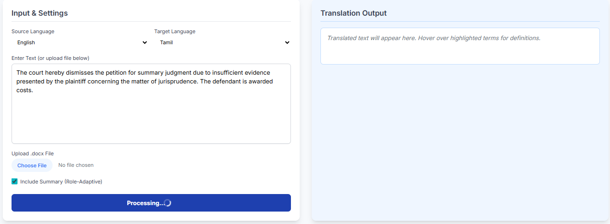
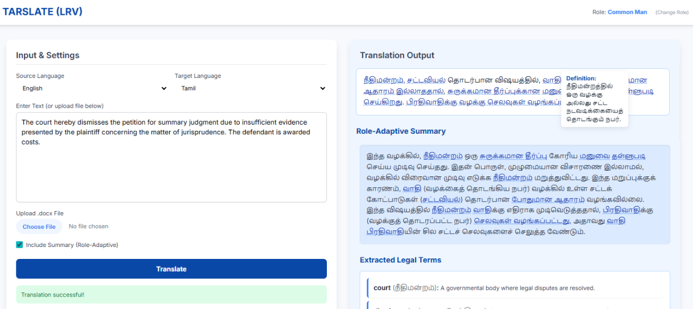
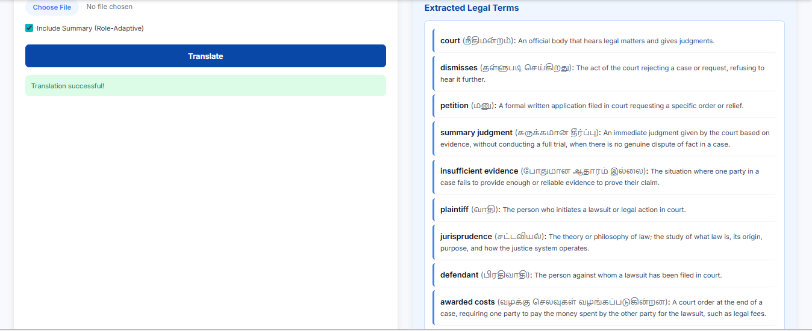

# TARSLATE (LRV) - Legal Translation & Summarization

TARSLATE is a specialized legal-tech tool designed to bridge the gap between complex legal jargon and everyday understanding. Using **Gemini 2.5 Flash**, it translates legal documents between English and Tamil while providing role-adaptive summarization.

## 🚀 Features
- **Bilingual Support:** High-accuracy translation between English and Tamil.
- **Role-Adaptive Summarization:** Choose between 'Lawyer', 'Paralegal', or 'Common Man' for custom summary complexity.
- **Interactive Legal Terms:** Automatically identifies and defines legal terms with hoverable tooltips.
- **File Support:** Handles raw text input and `.docx` file uploads.

## 📸 Demo Screenshots

### 1. User Role Selection

### 2. Content Input

### 3. Legal Translation & Role-Adaptive Summary

### 4. Extracted Legal terms

## 🛠️ Tech Stack
- **Backend:** FastAPI, Python, Google Gemini API
- **Frontend:** HTML5, Tailwind CSS, Vanilla JavaScript
- **Libraries:** python-docx, google-genai, pydantic

## 📐 Project Architecture
The application follows a Client-Server architecture:
1. **Frontend**: A responsive SPA (Single Page Application) built with Tailwind CSS that handles user roles and asynchronous API fetching.
2. **Backend**: A FastAPI REST server that performs document parsing and handles secure communication with the Google Gemini LLM.
3. **AI Layer**: Prompt-engineered system instructions ensure legal accuracy and role-specific output formatting in JSON.

## 🔧 Installation & Setup
1. Clone the repo: `git clone <repo-link>`
2. Create venv: `python -m venv venv`
3. Activate venv: `venv\Scripts\activate`
4. Install dependencies: `pip install fastapi uvicorn google-genai pydantic python-docx httpx python-multipart`
5. Set API Key: `set GEMINI_API_KEY=your_key_here`
6. Run Backend: `uvicorn main_backend:app --reload`